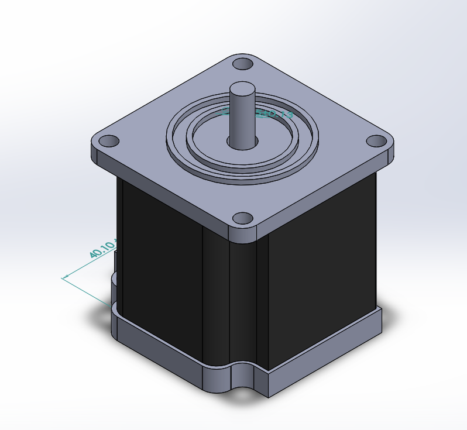
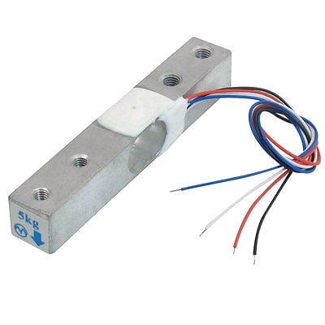

# **E-Waste Bin**

## **Abstract**

The E-Waste Bin is a smart bin which can collect and segregate 5 types
of waste namely Phones, Headphones, Watches, Mouses and chargers.

   
 

## **Motivation**

Nowadays, we are facing significant issues with E-Waste, they are
hazardous to the environment if not disposed of properly, and some of
this waste can be recycled easily. We need to collect them and segregate
them for proper disposal or recycling, and this E-Waste Bin can be
beneficial in doing so.

Also one must gain valuable experience in working with sensors and
**Arduino**, making physical models, and digital models on software like
**Solidworks**.

**Components**

-   Stepper motor & drivers L298n x2

-   Load cell & Hx711 x1

-   Arduino mega x1

-   Ultrasonic sensor x2

-   Dustbin x1

-   Webcam x1

-   Flywheel frame x1

-   Pi-shaped panel x2

-   Rectangular flap x1

-   Circular disk x1

-   Rectangular cardboard x5

-   Aluminium rods x5

-   Angle brackets x5

## **Workflow**

### **Mechanical Aspect of the Design**

**BIN**

The Bin is a standard-sized P.V.C. dust bin with a circular face;

**Pi shaped panels**

Two pi-shaped panels were cut out from thick cardboard. They are holding
Load cell between them attached with nut and bolts, and a small sector
from the lower panel is removed with centres of both coinciding, and
thus the emerging part of the upper pane is attached to the Stepper
motor.

**Fly-Wheel**

It was cut out from a wooden panel, the spikes are strengthened by
attaching aluminium strips. The solid circle in the centre holds the
stepper motor (which is rotating the Pi-shaped panel) along the central
axis of the bin, it works as a frame for cardboards used for inner
partitioning in the bin and it also works as a base for the circular
disk working as an upper lid.

This Flywheel is placed on the top of the bin, fixed by nuts and bolts.

**Flap and Upper lid**

The upper lid which is a wooden circular disk is standing on the
flywheel frame by five aluminium rods.

A stepper motor is fixed on the centre of the lid along the central axis
and its rotating part is holding the wooden flap. The height of lid so
adjusted that it leaves a gap of 1cm between flap and Pi panels.

### **Electronics Aspect of the Design**

**Stepper motor**

The bin uses two 12-volt stepper motors, 200 steps per rotation. These
motors are controlled by L298n stepper drivers.

Using the stepper motor along with drivers provide rotations at required
angles with precision at a faster speed, increasing the accuracy of the
bin and saving time consumed in motion.

**Arduino Mega**

-   It has a large number of pins, hence all the sensors and motors can
    be connected easily.

-   Can be used for years as, 4 KB of EEPROM space available.

**Load-cell & HX711**

-   We used 1 Kg load cell with HX711 ADC chip.

-   The strain gauge provides it a high precision, it can measure very
    slight changes in weights making it suitable for lighter electronic
    waste like earphones.

**Ultra sonic sensor (HC-SR04)**

-   It can calculate accurate position of an object across two meters.

-   We have used it to control when to energise the Load cell and HX711
    which increases their life.

**Object Detection**

-   Object detection is done by using Ultralytics Model based on YOLOv5
    and Pytorch and is trained over the custom dataset.

-   YOLOv5 is one of the most high-performing object detectors out
    there. It is fast, has high accuracy and is incredibly easy to
    train.

**Cost Structure**
 
  -----------------------------------------------------------------------           
 | **Components**                    |  **Quantity**     |     **Cost(INR.)**          | 
 | :-----------------------:         | :--------------:  |  :---------------------:    |
 |  Motor Driver L2898               |      2            |            240              |
 |                                   |                   |                             |
 |  Stepper Motors                   |      2            |            2050             |
 |                                   |                   |                             |
 |  Arduino Mega                     |      1            |            2200             |
 |                                   |                   |                             |
 | 12v Battery                       |      1            |            900              |
 |                                   |                   |                             |
 | Ultrasonic Sensor                 |      2            |            100              |
 |                                   |                   |                             |
 | Load Cell                         |      1            |            520              |
 |                                   |                   |                             |
 | HX711                             |      1            |            150              |
 |                                   |                   |                             |
 | Dustbin                           |      1            |            750              |
 |                                   |                   |                             |                                                                                                                  |                   |                             |  
 |                 **Total**         |                   |             6,910           |
  
**Applications**

-   Collects and Segregates the E-Waste.

-   Increases the recyclability of E-Wastes.

-   Can be applied with a reward/royalty point-based system.

**Limitations**

-   Can only able to collect & separate only a few specific wastes like
    chargers, Mouse, smartphones etc.

-   Object detection is carried out on a laptop.

-   If modified for segregation in more categories then, it will consume
    a large space.

-   It's hard to empty the bin, one needs to completely remove the upper
    portion for doing.

> **Future Improvements**

-   We can use Rasberry pi to carry out image processing and object
    detection and can add some more sensors to carry out segregation on
    basis of recyclability making it more practical.

-   Can be applied with an online reward-based mechanism to make it more
    appealing.

**Team Members**

1.  [Aastha Tembhare](https://github.com/Aastha-tembhare)

2.  [Jitesh Bhati](https://github.com/jiteshbhati305)

3. [Shreya Mittal](https://github.com/ShreyaMittalSM)

4.  [Kaivalya](https://github.com/kai-013)

**Mentors**

1.  [Abhay Pratap Singh](https://github.com/DarthEkLen)

2.  [Harikhrishnan P.B.](https://github.com/MurkeyCube)

3.  [Sanjeev Krishnan](https://github.com/SanjeevKrishnan)

**References**

-   [HX711 module](https://youtu.be/sxzoAGf1kOo)

-   [Ultralytics github](https://github.com/ultralytics/yolov5)

-   [LabelImg](https://github.com/heartexlabs/labelImg)

-   [SolidWorks tutorials](https://youtu.be/36Bry_57Pcc)

-   [Yolo Drowsiness Detection](https://github.com/nicknochnack/YOLO-Drowsiness-Detection)

-   [Coustom dataset training Yolov5](https://youtu.be/80Q3HIBy7Qg)

-   [Arduino tutorial](https://randomnerdtutorials.com/arduino-load-cell-hx711)
